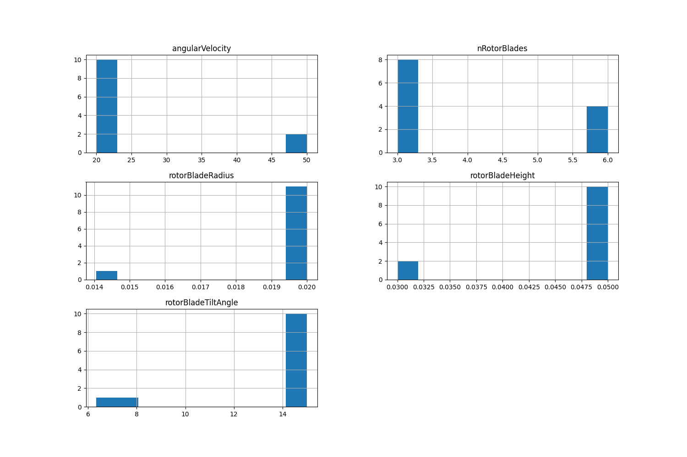
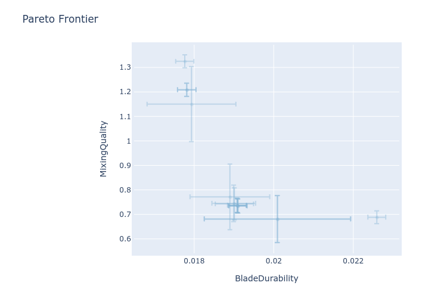
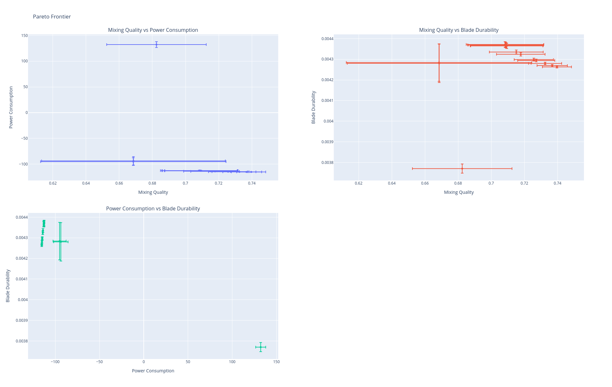
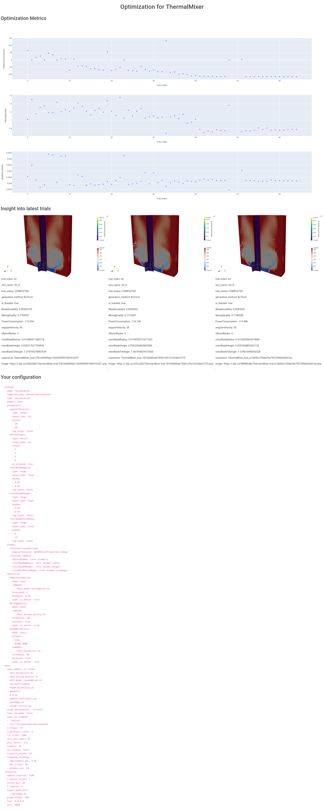

# Bayesian Optimization of an annular thermal mixer with OpenFOAM and foamBO


A WIP demonstration (PoC) repository on how to use `foamBO` to run Bayesian Optimization
algorithms on OpenFOAM cases.

## Requirements and running

Take a look at `config.yaml` for the parameter set and objective functions.

```bash
pip install -r requirements.txt # is a good idea
# You also need to have ParaView 5.10 or later (for pvpython)
# To start the optimization study:
foamBO
# If you want to monitor trials as they complete;
# by rendering results, set:
export IMGBB_API_KEY=<your-api-key-from-imgbb.com>
foamDash
```

## Q&As

### 1. How many case runs do we need to reach a conclusion?

If one considers some increments to represent the minimal change in a parameter value that
might result in a considerable effect on the objective functions, we get 14784 total brute-force cases:
- `angularVelicity`: range (20, 50), increment 5 -> 7 values
- `nRotorBlades`: range (3, 6) -> 4 values
- `rotorBladeRadius`: range (0.01, 0.02), increment 0.002 -> 6 values
- `rotorBladeHeight`: range (0.03, 0.05), increment 0.002 -> 11 values
- `rotorBladeTiltAngle`: range (0, 15), increment 2 -> 8 values

That's 2464 hours (a 100 days) of simulating the coarse `annularThermalMixer` case.

#### 1.1 Trials-to-"convergence" for the Bayesian optimization algorithm

With 70 max trials (4 max parallel trials), the `BOTorch` algorithm convergence in **65 trials**.
One nice feature of Bayesian Algorithms is that the stopping strategy can shifted from
objective values over to the **probability of improving on current best optima estimations**.
```yaml
meta:
  stopping_strategy:
    # If the probablity of improvement falls under this value, stop
    improvement_bar: 1e-2 # 1%
    # Minimal trials before considering the stopping strategy
    min_trials: 25
    # How many trials to consider for computing the improvement probability
    window_size: 10
```

#### 1.2 Parallel trials vs total trial number trade-off 

The Ax framework starts `BOTorch` with 4 parallel trials, but then increases this number to 5
after the initial SOBOL runs. A while later it lowers to 3. Looking at objective functions' values,
the framework did a decent job in picking a good parallel trials number to increase efficiency but
not sacrificing much parameter space discovery.

#### 1.3 How sensitive the convergence time is to adding a continuous-value parameter to the search space

> TODO: formulate an opinion

## Necessary changes to the OpenFOAM case

> [!TIP]
> Git shows more accurate changes:
> ```bash
> treecommit=$(git log --format='%H' --author=Elwardi --reverse -- annularThermalMixer/ | head -1)
> git diff $treecommit..HEAD -M -- annularThermalMixer
> ```
> But this section will motivate the important ones.


### 1. Geometry generation

- All original OBJ geometries are converted to (non-compressed) STL format.
- `shaft.stl`, `statorBlades.stl` and `rotorBlades.stl` are now dynamically
  generated by `geometry/generate.py` Python script, based on `constant/cadDict` settings.
- `Allrun` is modified to run `geometry/generate.py` instead of copying original surfaces.

I still have some concerns:

- `snappyHexMesh` is kept as the mesh generator, and it doesn't keep a constant max
  cell size if the dimensions of the domain change (eg. How far the AMI patch is from the shaft).
  So, any optimization study may be biased towards specific sets of dimensions. `cfMesh`
  would do better.

### 2. Parallel execution

- A single serial run of the case takes around 20 mins to simulate 1 sec.
  Overall mesh resolution has been lowered from the base case.
- The case is parallelized for 4 processors, anticipating parallel runs of the case
  by the optimization algorithm. Trial execution time becomes 10 mins with 4 procs.

### 3. Objectives computation

The following objective functions are computed using `obj*.sh` scripts for convenience.
Scalar values to represent the following objectives are chosen so the minimization of
the scalar values results in better objectives.

1. Blade durability is estimated through erosion prediction which is represented by
   wall shear stress, raised to some power (2, or 3); Total surface area of patch faces with more than 70% 
   of the value-range of "the shear stress squared" is used as an indication of possible erosion regions.
1. Mixing quality is estimated through Coefficient of variation (CoV) of component concentrations (alpha fields).
    - This is a two-phase computation, so there is only one alpha field
1. Power consumption is computed through pressure and shear stress fields on the impeller.
    - Torque is computed through `propellerInfo` function object.
    - Power consumption = torque x blade rotational speed

## Lessons learned

### First run: Sensitivity to proper representation of the objective functions

The first run of the optimization algorithm featured the **total surface area** of the blade regions
where the shear stress squared is more than 70% of its range as an objective function.

Out of the 15 requested Pareto Frontier points, 12 suggested 3 blades (the minimal blade count)
which, obviously, doesn't bode well with the fact that more blades usually means better mixing quality.

**Well, more blades just means greater total surface** so favoring less blades is to be expected. Also,
note that at the time of computing the Pareto Frontier, the algorithm was nowhere close to convergence
(only 30 trials, 6 of which generated with SOBOL).

**Solution:** Weigh this objective value with either the total impeller surface, or number of blades.

Out of the 30 tried trials, 18 were completed. The failed trials featured only blades count of 3 and 6, which
is also related to `rotorBladeRadius` and `rotorBladeHeight`. I made peace with this fact, because otherwise
I will need to setup dependencies between parameters, which can give not-so-trivial-to-analyse results.
For now, these trials fail, and we know why most of them do. The failed trials feature no other correlations,
30 trials (with 18 completing) is just not enough:



> What's more concerning is the algorithm's (SAASBO) insistence on trying around failing parameter sets.
> Because we don't have huge search spaces, yet It's better to opt out of SAASBO in favor of something
> like BOTorch or GPEI

A clear indication of the quality of optimization results is the uncertainty around Pareto Frontier points.
As seen in the following plot, the error bars can be quite large:



### Second run: Reports for `BOTorch` model instead of `SAASBO`

The frontier looks much better, even though there is a bug reporting power consumption as negative values!!



In particular, in the **Power consumption vs Blade durability** plot, the points on the left all feature
a blade count of 5, the one on the right has 6 blades. So the algorithm suggests a jump in power consumption
if more blades (more than 5) are added.

Looking also at the **Mixing quality vs Power consumption** plot, we see the 6 blades prediction doesn't
provide better mixing quality anyway.

At first glance, the error bars on mixing quality may seem too big, but in fact, using 3 and 4 blades
results in much lower mixing quality, so the pareto frontier doesn't include those and hence doesn't cover
the whole range of possible mixing quality values: 0.1 errors in 0.6-0.7 CoV are still considerable but
will probably improve by using denser case mesh.

`foamDash` utility sets a monitoring dashboard to monitor objective function evolution and renders the last
three trials if configured to do so:



## Next steps

Implementation some validation mechanism in `foamBO`. Picking a set of parameters close to the Pareto Frontier
and actually simulating it might be useful in boosting users confidence in their results.
