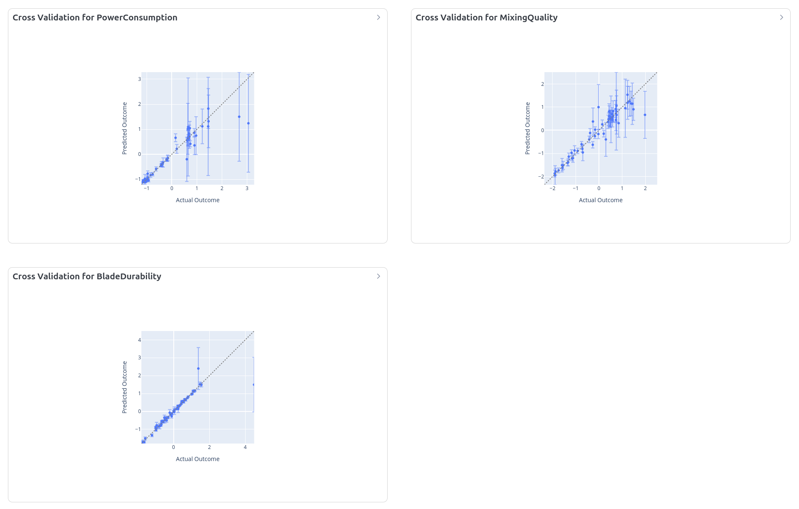
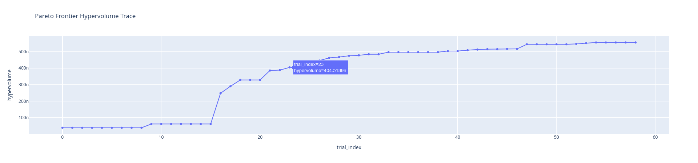
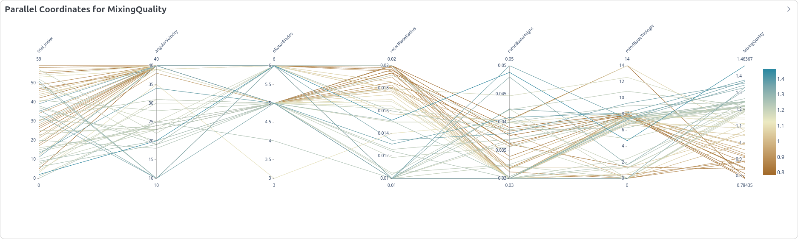
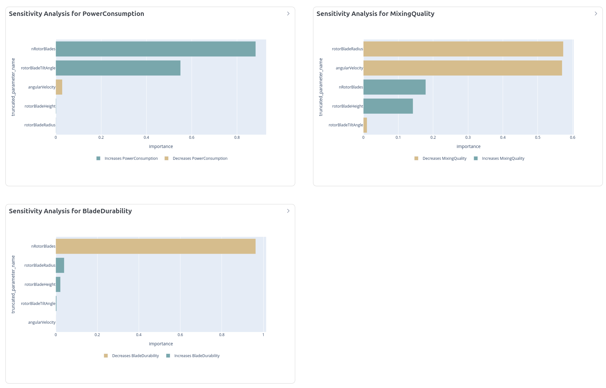
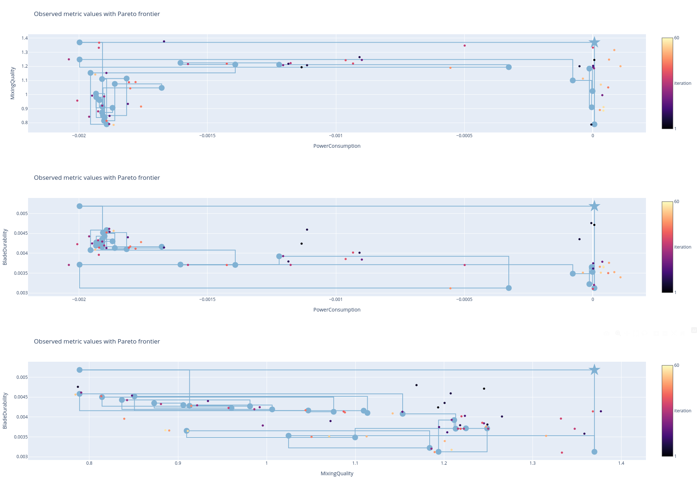
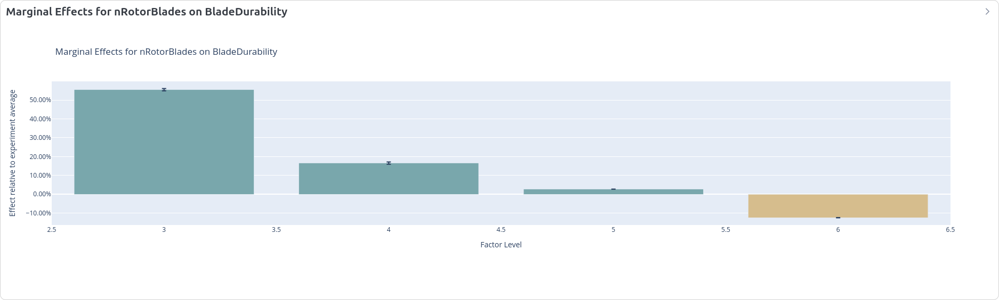
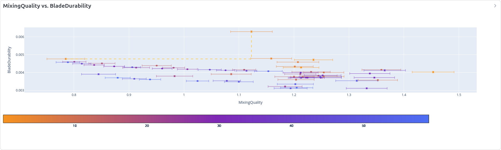
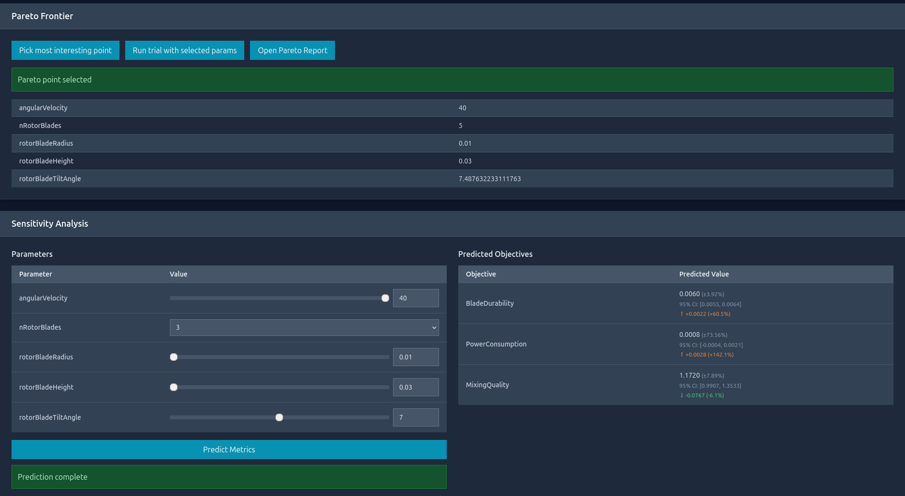

# Bayesian Optimization of an Annular Thermal Mixer with `OpenFOAM` and `foamBO`


A WIP demonstration (PoC) repository on how to use `foamBO` to run 
Multi-objective Bayesian Optimization algorithms on OpenFOAM cases.

<!-- mtoc-start:cb9ef56 -->

* [Requirements for reproducing the optimization](#requirements-for-reproducing-the-optimization)
* [Q&As](#qas)
  * [How many case runs do we need to reach a conclusion?](#how-many-case-runs-do-we-need-to-reach-a-conclusion)
    * [Trials-to-"convergence" for the Bayesian optimization algorithm](#trials-to-convergence-for-the-bayesian-optimization-algorithm)
    * [How sensitive the convergence time is to adding another parameter to the search space](#how-sensitive-the-convergence-time-is-to-adding-another-parameter-to-the-search-space)
* [Necessary changes to the OpenFOAM case](#necessary-changes-to-the-openfoam-case)
  * [Geometry generation](#geometry-generation)
  * [Parallel execution](#parallel-execution)
  * [Objectives computation](#objectives-computation)
* [Optimization insights](#optimization-insights)
* [Lessons learned](#lessons-learned)
  * [Reports for updating to foamBO v1.1.0 (from v0.1.2)](#reports-for-updating-to-foambo-v110-from-v012)

<!-- mtoc-end:cb9ef56 -->

## Requirements for reproducing the optimization

```bash
./prepare.sh # Makes sure you have required tools
```


Take a look at [MOO.yaml](./MOO.yaml) for the **parameter set** and **objective functions**,
which should be self-explanatory.

To poke around the published state of the optimization:

```bash
uvx foamBO visualize --config MOO.yaml ++store.read_from=json
```

To run an optimization study from scratch:

```bash
uvx foamBO@1.1.0 --config MOO.yaml ++store.read_from=nowhere
```

> [!NOTE]
> Since the optimization is seeded with random trials, this will not be an exact
> reproduction. If you want exact reproducibility, you can seed the random trial
> generator with a fixed number. For more information on this, run:
> `uvx foamBO --docs`
> and look for "seed"

## Q&As

### How many case runs do we need to reach a conclusion?

If one considers some increments to represent the minimal change in a parameter value that
might result in a considerable effect on the objective functions, we get 14784 total brute-force cases:
- `angularVelocity`: range (10, 40), increment 5 -> 7 values
- `nRotorBlades`: range (3, 6) -> 4 values
- `rotorBladeRadius`: range (0.01, 0.02), increment 0.002 -> 6 values
- `rotorBladeHeight`: range (0.03, 0.05), increment 0.002 -> 11 values
- `rotorBladeTiltAngle`: range (0, 14), increment 2 -> 8 values

That's 2464 hours (100 days) of simulating the (very) coarse `annularThermalMixer` case.

#### Trials-to-"convergence" for the Bayesian optimization algorithm

With 70 max trials (4 max parallel trials), the `BOTorch` algorithm converges in **~60 trials**.

One nice feature of Bayesian Algorithms is that the stopping strategy can be shifted from
objective values over to the **probability of improving on current best optima estimations**.

```yaml
# These are pretty relaxed settings
orchestration_settings:
  global_stopping_strategy:
    min_trials: 20
    window_size: 10
    improvement_bar: 0.3
```

#### How sensitive the convergence time is to adding another parameter to the search space

By adding a `choice` parameter with 6 possible values - which extends the search space to 88.7k
brute-force cases - the optimization algorithm takes only few more trials to converge under the
same conditions. It should be noted that the added parameter was not more significant to any
of the objectives than the existing ones:
```yaml
nStatorBlades:
  type: choice
  value_type: int
  values: [3, 4, 5, 6, 7, 8]
  is_ordered: True
```

For this optimization case, adding a `range` parameter of some significance to at least one
the objectives can be expected to increase time-to-convergence by 10-15 trials.

## Necessary changes to the OpenFOAM case

> [!TIP]
> Git shows more accurate changes:
> ```bash
> treecommit=$(git log --format='%H' --author=Elwardi --reverse -- annularThermalMixer/ | head -1)
> git diff $treecommit..HEAD -M -- annularThermalMixer ':(exclude)*.stl'
> ```
> But this section will motivate the important ones.


### Geometry generation

- All original OBJ geometries are converted to (non-compressed) STL format.
- `shaft.stl`, `statorBlades.stl` and `rotorBlades.stl` are now dynamically
  generated by [`scripts/generate.py`](./scripts/generate.py) Python script, based on
  [`constant/cadDict`](./annularThermalMixer/constant/cadDict) settings.
- `Allrun` is modified to run `geometry/generate.py` instead of copying original surfaces.

I still have some concerns:

- `snappyHexMesh` is kept as the mesh generator, and it doesn't keep a constant max
  cell size if the dimensions of the domain change (eg. How far the AMI patch is from the shaft).
  So, any optimization study may be biased towards specific sets of dimensions. `cfMesh`
  would do better.

### Parallel execution

- A single serial run of the case takes around 20 mins to simulate 1 sec.
  Overall mesh resolution has been lowered from the base case.
- The case is decomposed for 4 processors, where the execution time becomes 10 mins.

### Objectives computation

The following objective functions are computed using `scripts/obj*.sh` shell scripts for convenience.

Scalar values to represent the following objectives are chosen so their minimization of
the scalar values results in better objectives.

1. Blade durability is estimated through erosion prediction which is represented by
   wall shear stress, raised to some power (2, or 3); Total surface area of patch faces with more than 70% 
   of the value-range of "the shear stress squared" is used as an indication of possible erosion regions.
1. Mixing quality is estimated through Coefficient of variation (CoV) of component concentrations (alpha fields).
    - This is a two-phase computation, so there is only one alpha field
1. Power consumption is computed through pressure and shear stress fields on the impeller.
    - Torque Coefficient is computed through `propellerInfo` function object.
    - Power consumption = torque x blade rotational speed

## Optimization insights

Let's start by looking at the surrogate model's cross-validation plots after around 60 trials, which:

- suggest that the model is trained to predict blade durability the most.
- suggest that the model will predict power consumption with the most uncertainty.

But, it seems the model has picked up significant signal on all metrics.



A quick look at the Hyper-Volume trace suggests that the model would benefit from tighter improvement bar
as it's still taking an increasing trend:



Now that we know what to expect from the surrogate model, we may investigate how much of the search space
was explored:



Observe that:
- The Bayesian algorithm preferred maximum range value of `angularVelocity` and `rotorBladeRadius` which indicates
  a desire to explore past the parameter range, suggesting the optimal points are further up the specified range
- The algorithm also preferred lower `rotorBladeHeight` and `rotorBladeTiltAngle` values.

The next question would be: **which parameter are most important to which objectives?**



These insights should be understood only at and around the Pareto frontier computed using the given
baseline parameter set:



In order to understand more how exactly changing some choice-type parameters affect an objective, we can
look at marginal effects plots:



> [!WARNING]
> `bladeDurability` is just an evaluation of "stress on blade patches". It was not named properly as
> "blade brittleness" is a better name. We would want to maximize the "actual durability" of the blades.


As confirmation for earlier analysis, one can look at the trial's objectives plotted against each other;
we can clearly see that the model has much more confidence in `bladeDurability`:



Loading the visualizer UI on this optimization allows to

- Pick an objective to focus the analysis on
- Explore how much the objectives would be affected by changing various parameter values.

It's important to understand that this analysis is only valid
around the Pareto frontier points, hence the display of confidence intervals:



## Lessons learned

> [!IMPORTANT]
> You can access past lessons from past README commits

### Reports for updating to foamBO v1.1.0 (from v0.1.2)

I did some minor changes to the parameter ranges so no failed trials are tried, and relaxed the stopping
strategy a little bit.

Overall, the optimization process went smoother than with v0.1.2 and the reports are much better.
Within 60 trials, the optimization meets the stopping criteria and the SEM values on the Pareto frontier
are all less than 3%.

With v1.1.0 optimization visualizer, we can easily make well-informed decisions on what parameters to tweak, in
which direction, in order to trade efficiently between objectives.
